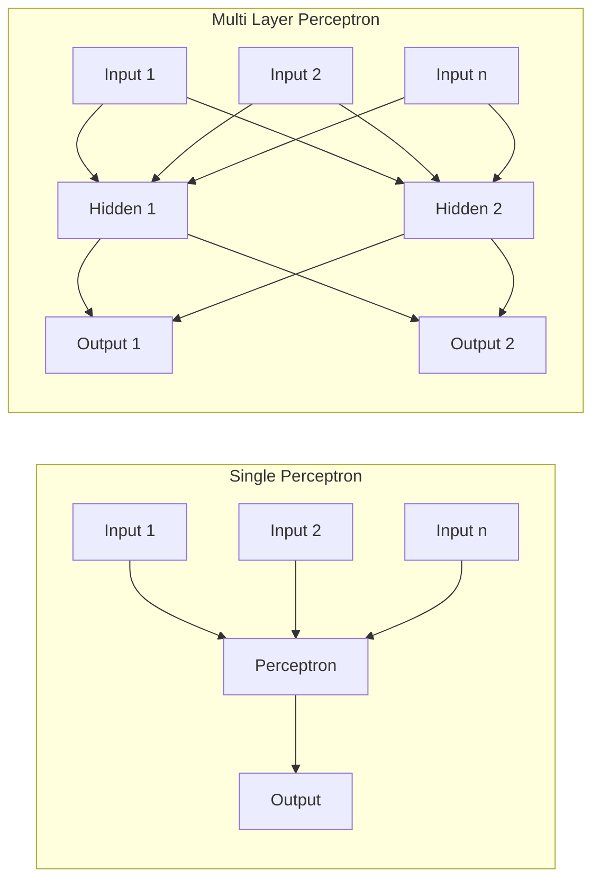

## Multi Layer Perceptron (MLP) คืออะไร?

Multi Layer Perceptron หรือ MLP คือเครือข่ายประสาทเทียมที่มีหลายชั้น (layers) ซ้อนกัน โดยประกอบด้วย input layer, hidden layer(s) และ output layer

### ความแตกต่างระหว่าง MLP กับ Perceptron ธรรมดา

- **จำนวนชั้น:** Perceptron ธรรมดามีเพียงชั้นเดียว (single layer) ในขณะที่ MLP มีหลายชั้นซ้อนกัน
- **ความสามารถในการแก้ปัญหา:** Perceptron ธรรมดาสามารถแก้ได้เฉพาะปัญหาที่แบ่งแยกได้เชิงเส้น (linearly separable) เท่านั้น แต่ MLP สามารถแก้ปัญหาที่ซับซ้อนและไม่เป็นเชิงเส้น (non-linear) ได้
- **ฟังก์ชันกระตุ้น:** Perceptron ใช้ step function แต่ MLP มักใช้ฟังก์ชันกระตุ้นแบบต่อเนื่อง เช่น ReLU, Sigmoid หรือ Tanh
- **การเรียนรู้:** MLP ใช้ backpropagation algorithm ในการเรียนรู้และปรับค่าน้ำหนัก ซึ่งซับซ้อนกว่าการเรียนรู้ของ Perceptron ธรรมดา

### ข้อดีของ MLP

- สามารถเรียนรู้และจดจำรูปแบบที่ซับซ้อนได้
- เหมาะสำหรับงานการจำแนกประเภท (classification) และการประมาณค่า (regression) ที่ซับซ้อน
- มีความยืดหยุ่นในการปรับแต่งโครงสร้างตามความเหมาะสมของปัญหา

อย่างไรก็ตาม MLP ก็มีข้อจำกัดในเรื่องของการต้องการข้อมูลฝึกฝนจำนวนมาก และการปรับแต่งพารามิเตอร์ที่เหมาะสมอาจทำได้ยาก

## ประวัติและการพัฒนาของ MLP

แนวคิดของ Multi Layer Perceptron มีรากฐานมาจากการพัฒนาต่อยอดจาก Perceptron ดั้งเดิมที่คิดค้นโดย Frank Rosenblatt ในปี 1957

- **ช่วงทศวรรษ 1960:** Marvin Minsky และ Seymour Papert แสดงให้เห็นข้อจำกัดของ Single Layer Perceptron ในหนังสือ "Perceptrons" ที่ไม่สามารถแก้ปัญหา XOR ได้
- **ช่วงทศวรรษ 1970-1980:** Paul Werbos เป็นคนแรกที่นำเสนอแนวคิด **Backpropagation** ในวิทยานิพนธ์ปี 1974 ซึ่งเป็นพื้นฐานสำคัญของ MLP
- **ปี 1986:** **David Rumelhart, Geoffrey Hinton และ Ronald Williams ได้เผยแพร่งานวิจัยที่ทำให้ Backpropagation เป็นที่รู้จักอย่างแพร่หลาย และทำให้ MLP ได้รับความนิยม**

การพัฒนา MLP เป็นก้าวสำคัญในประวัติศาสตร์ของปัญญาประดิษฐ์ เพราะแสดงให้เห็นว่าเครือข่ายประสาทเทียมสามารถแก้ปัญหาที่ซับซ้อนและไม่เป็นเชิงเส้นได้ ซึ่งเป็นพื้นฐานสำคัญที่นำไปสู่การพัฒนา Deep Learning ในปัจจุบัน

แผนผังข้างต้นแสดงให้เห็นความแตกต่างระหว่าง Single Perceptron ที่มีเพียงชั้นเดียว กับ Multi Layer Perceptron ที่มีชั้น Hidden Layer อยู่ระหว่าง Input และ Output ทำให้สามารถเรียนรู้รูปแบบที่ซับซ้อนได้มากกว่า

## MLP กับ Deep Learning มีความแตกต่างกันอย่างไร?

MLP และ Deep Learning มีความเกี่ยวข้องกัน แต่มีความแตกต่างที่สำคัญดังนี้

- **จำนวนชั้น:** MLP อาจมีเพียง 2-3 ชั้นซ่อน (hidden layers) ในขณะที่ Deep Learning มักมีจำนวนชั้นมากกว่า (มากกว่า 3 ชั้นขึ้นไป)
- **ความซับซ้อน:** Deep Learning มีโครงสร้างที่ซับซ้อนกว่า MLP มาก และสามารถเรียนรู้ feature ในระดับที่ซับซ้อนและเป็นลำดับชั้นได้ดีกว่า
- **การประยุกต์ใช้:** MLP เหมาะกับงานที่ไม่ซับซ้อนมาก ในขณะที่ Deep Learning เหมาะกับงานที่ซับซ้อนสูง เช่น การประมวลผลภาพ การประมวลผลภาษาธรรมชาติ
- **ทรัพยากรที่ต้องการ:** Deep Learning ต้องการทรัพยากรการประมวลผลและข้อมูลฝึกฝนมากกว่า MLP อย่างมีนัยสำคัญ

สรุปคือ MLP เป็นส่วนหนึ่งของ Deep Learning แต่ Deep Learning มีความซับซ้อนและความสามารถที่มากกว่า MLP ทั้งในแง่ของโครงสร้างและการประยุกต์ใช้งาน

# ทั้ง TensorFlow และ PyTorch มีข้อดีดังนี้:

- **การจัดการ GPU:** รองรับการคำนวณบน GPU โดยอัตโนมัติ
- **Automatic Differentiation:** คำนวณ gradients อัตโนมัติ
- **Built-in Optimizers:** มี optimizer หลากหลายให้เลือกใช้
- **การปรับแต่งง่าย:** สามารถปรับเปลี่ยนโครงสร้างโมเดลได้ง่าย
- **Ecosystem ที่สมบูรณ์:** มีเครื่องมือและไลบรารีเสริมมากมาย

## แนวทางการเลือก Activation Functions

การเลือก Activation Functions ที่เหมาะสมเป็นสิ่งสำคัญในการสร้างโมเดล โดยมีหลักการพิจารณาดังนี้:

### 1. Hidden Layers

- **ReLU:** เป็นตัวเลือกแรกที่ควรพิจารณา
    - ทำงานเร็ว ไม่มีปัญหา vanishing gradient
    - เหมาะกับ deep networks และข้อมูลทั่วไป
- **Leaky ReLU:** ใช้เมื่อเจอปัญหา dying ReLU
    - ช่วยแก้ปัญหา neurons ที่ไม่ทำงาน
    - เหมาะกับโมเดลที่มีปัญหาการเรียนรู้ช้า
- **Tanh:** เหมาะกับ
    - ข้อมูลที่มีค่าทั้งบวกและลบ
    - โมเดลที่ต้องการ normalize ข้อมูลระหว่างชั้น

### 2. Output Layer

- **Sigmoid:** เหมาะกับ
    - Binary classification
    - การทำนายความน่าจะเป็น
- **Softmax:** เหมาะกับ
    - Multi-class classification
    - การทำนายความน่าจะเป็นหลายคลาส
- **Linear:** เหมาะกับ
    - Regression problems
    - การทำนายค่าต่อเนื่อง

### 3. ข้อควรระวัง

- **หลีกเลี่ยง Sigmoid ใน hidden layers**
    - มีปัญหา vanishing gradient
    - ทำให้การเรียนรู้ช้า
- **ทดลองหลาย ๆ แบบ**
    - ผลลัพธ์อาจแตกต่างกันตามลักษณะข้อมูล
    - ควรทำการทดสอบเปรียบเทียบประสิทธิภาพ
